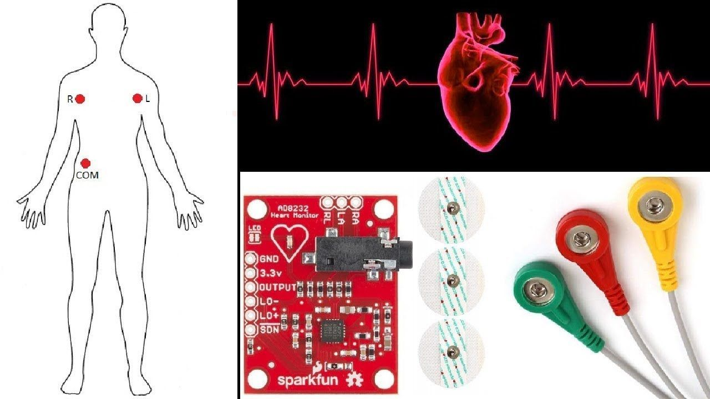

<!-- 

  Detect QRS peak of ECG wave on STM32y 🫁

 -->
# Detect QRS peak of ECG wave on STM32 

  

### 📑 <b>0.</b>  Overview   

This project implements a real-time QRS detection system for ECG signals using the STM32F411 microcontroller. The system is based on the Pan-Tompkins algorithm, a well-known method for detecting QRS complexes (specifically the R peaks) in ECG signals. The project captures ECG data via ADC, processes it on the STM32F411, and sends the processed data (ADC values and QRS flags) to a Python script for visualization.

The system operates at a sampling rate of 200 Hz, collecting 10 seconds of data (2000 samples) and displaying a static plot of the ECG signal. The R peaks are marked with red dots on the plot.

### ⚙️ <b> 1. </b>  Technologies   

- Electrocardiogram (ECG) Sensor: Convenient and fast measurement.

- STM32-based: The project is based on the STM32 microcontroller and its supported platform.

- Communication Protocols: Includes connectivity such as UART.

- Peripheral Libraries: HAL-based firmware for this project.

- Graphic UI: Build GUI applications by using PyQt5.

### 💽 <b> 2. </b>  Main Features   

- Real-time QRS detection using the Pan-Tompkins algorithm.

- ECG signal acquisition at 200 Hz using the STM32F411's ADC.

- Signal preprocessing with bandpass filtering, derivative, squaring, and moving-window integration.

- Implemnt circular buffer library to read ADC data effencialy.

- Data transmission via UART to a Python GUI for visualization.

- Static visualization of the ECG signal and R peaks in 10 second.

### 📖 <b> 3. </b>  References   

- Pan, J., & Tompkins, W. J. (1985). "A Real-Time QRS Detection Algorithm." IEEE Transactions on Biomedical Engineering, Vol. BME-32, No. 3, pp. 230-236.