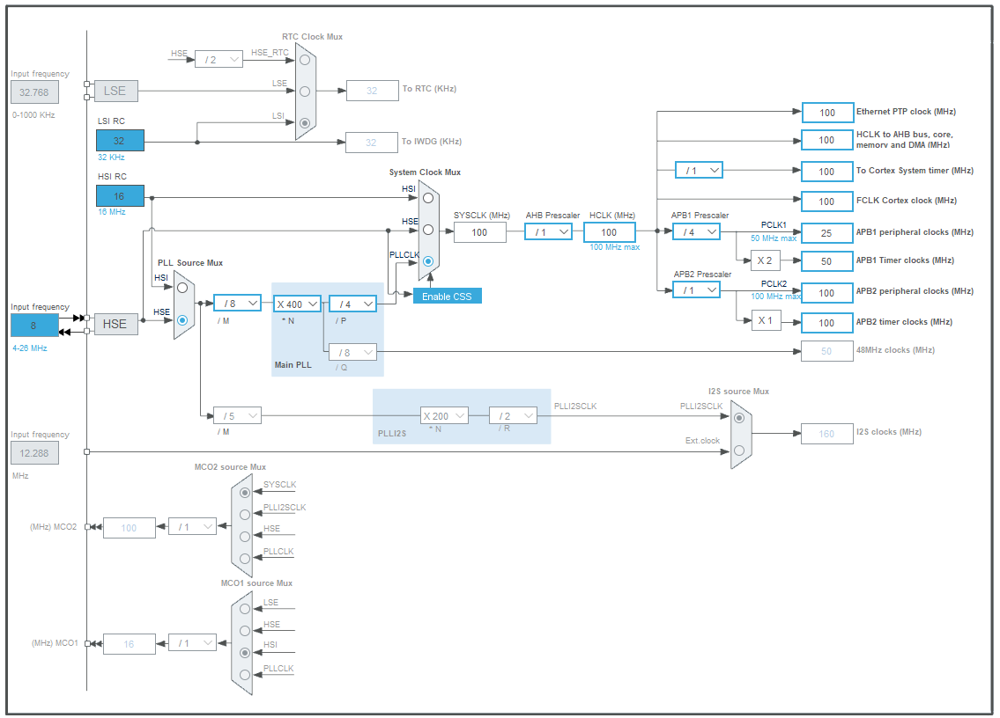

<!-- 

  Detect QRS peak of ECG wave on STM32y 🫁

 -->
# Detect QRS peak of ECG wave on STM32 

#### 📖 <b>Note that,</b> This **README** file is a step-by-step guide to setup. While there are some code snippets here, it is only a shorthand to illustrate what is in the file, so please do not copy the code in this file and put into your file to run, it can cause unwanted errors.  
Please strictly follow the instructions.

### ⚙️ <b>0.</b>  Overview   
First you need to install and add some necessary libraries for this project.

### 🧮 <b> 1. </b>  STM32 Configuration   

#### <b><i> a) Clock Configuration </i></b> 

RCC : 
- HSE : Crystal / Ceramic Resonator
- LSE : Disable

  

Make sure HCLK is set at 100 MHz.

#### <b><i> b) ADC Configuration </i></b>

Mode : IN0 equivalent to PA0 (ADC1_IN0)

Configuration : 

- Parameter Settings : 

  - Resolution: 12 bits 

  - Scan Conversion Mode: Disabled.

  - Continuous Conversion Mode: Enabled.

  - End of Conversion Selection: EOC flag at the end of single conversion.

  - Data Alignment: Right alignment.

#### <b><i> c) UART Configuration </i></b>

Mode : Asynchonus
Basic Parameters : 
- Baud rate : 115200
- Word length : 8 bits (including parity)

#### <b><i> d) Timer Configuration </i></b>
- Using Timer 2 (TIM2) corresponding to APB1 Clock (see at page 39 on STM32F411xC/E Referance Manual)

Given the following timer configuration:

- **APB1 Timer Clock**: 100 MHz
- **Prescaler (PSC)**: 1,249
- **Counter Period (ARR)**: 1,250

a. Calculating Timer Frequency ($f_{timer}$)

The timer frequency is determined using the formula:

$$ f_{timer} = \frac{f_{clock}}{(PSC + 1)} $$

Substituting the values:

$$ f_{timer} = \frac{100\text{ MHz}}{1249} \approx 69.63\text{ kHz} $$

b. Calculating Trigger Frequency ($f_{trigger}$)

The trigger frequency is calculated as:

$$ f_{trigger} = \frac{f_{timer}}{(ARR + 1)} $$

Substituting the values:

$$ f_{trigger} = \frac{69.63\text{ kHz}}{1250} \approx 64\text{ Hz} $$

c. ADC Sampling Rate

Since the timer trigger frequency determines the ADC sampling rate:

$$ \text{Sampling rate} = f_{trigger} = 64\text{ Hz} $$

The timer will generate a trigger signal 64 times per second. In other words, the ADC will perform the process of converting the analog signal from the sensor to a digital signal at a frequency of 64 samples per second (64 Hz).

