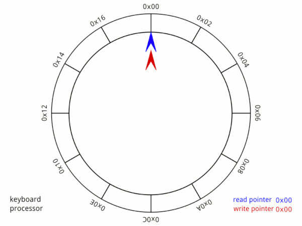
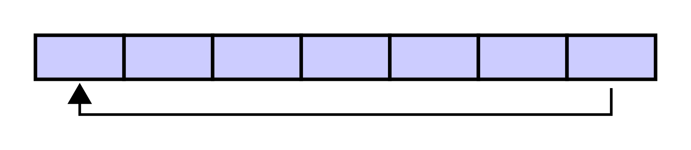
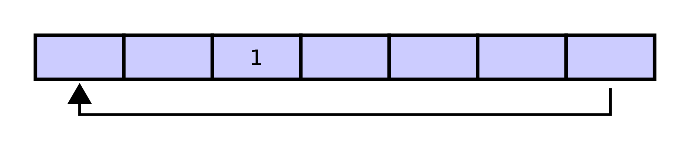
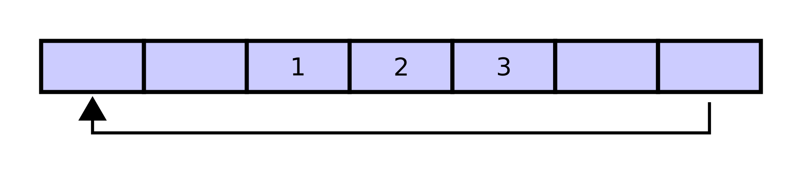
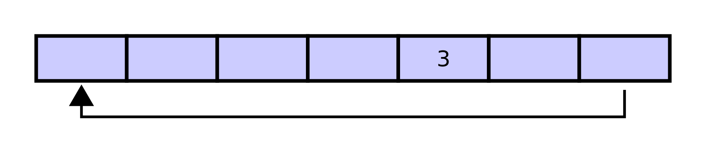
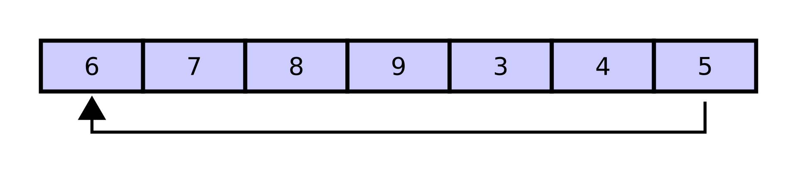
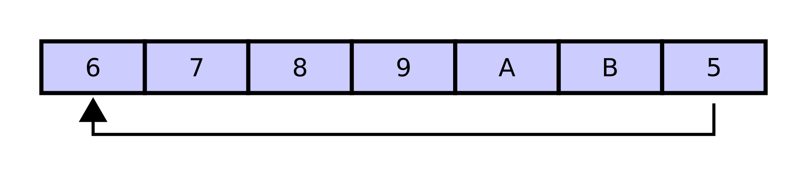
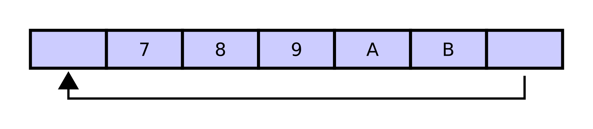

# Circular Buffer

This file will explain how circular buffer works in microcontroller.

## 🧮 Background

A circular buffer, also known as a ring buffer, is a data structure that uses a single, fixed-size buffer as if it were connected end-to-end. It is particularly useful for buffering data streams. The circular buffer first starts out empty and has a set length.

## 💡 Characteristics of the Circular Buffer

- **Fixed Size**: The buffer has a fixed size, which is defined when it is created.
- **FIFO (First In, First Out)**: The order of elements is preserved, with the oldest elements being removed first.
- **Overwrite Behavior**: When the buffer is full, new data can overwrite the oldest data if configured to do so.
- **Efficient Use of Space**: It uses memory efficiently by reusing buffer space as soon as it becomes free.
- **No Need for Data Shifting**: Unlike other data structures, the circular buffer does not require data to be shifted when elements are added or removed.
- **Simple Implementation**: It has a simple implementation with constant time complexity for both insertion and removal operations.

### 📊 Animation

Here is an animation of the circular buffer in action:

  

### 🧱 Diagram

#### **Initial Empty Buffer**

A 7-element buffer starts out empty:

#### **Writing Elements**

Assume that the element `1` is written in the center of the circular buffer:

Then, two more elements `2` and `3` are added to the circular buffer after `1`:

#### **Removing Elements**

If two elements are removed, the two oldest values inside of the circular buffer would be removed. Circular buffers use FIFO (first in, first out) logic. In this example, `1` and `2` were the first to enter the circular buffer, so they are the first to be removed, leaving `3` inside of the buffer:

#### **Full Buffer**

If the buffer has 7 elements, then it is completely full:

#### **Overwriting Elements**

A property of the circular buffer is that when it is full and a subsequent write is performed, it starts overwriting the oldest data. In this example, two more elements `A` and `B` are added, and they overwrite `3` and `4`:

Alternatively, the routines that manage the buffer could prevent overwriting the data and return an error or raise an exception. Whether or not data is overwritten is up to the semantics of the buffer routines or the application using the circular buffer.

#### **Final State**

Finally, if two elements are now removed, the returned elements are `5` and `6` (not `3` and `4` or `A` and `B`) because `5` and `6` are now the oldest elements:

## 🗺️ Folder Navigation
    
    ECG_QRS/
    ├── assets/
    │   ├── circular_buffer/
    │       ├── 1.png
    │       ├── 2.png
    │       ├── 3.png
    │       ├── 4.png
    │       ├── 5.png
    │       ├── 6.png
    │       ├── 7.png
    │       └── Circular_Buffer_Animation.gif
    └── docs/
        ├── CircularBuffer.md
 
